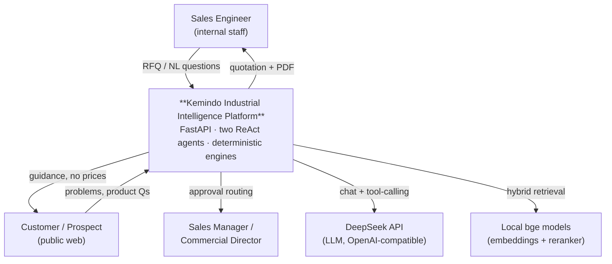
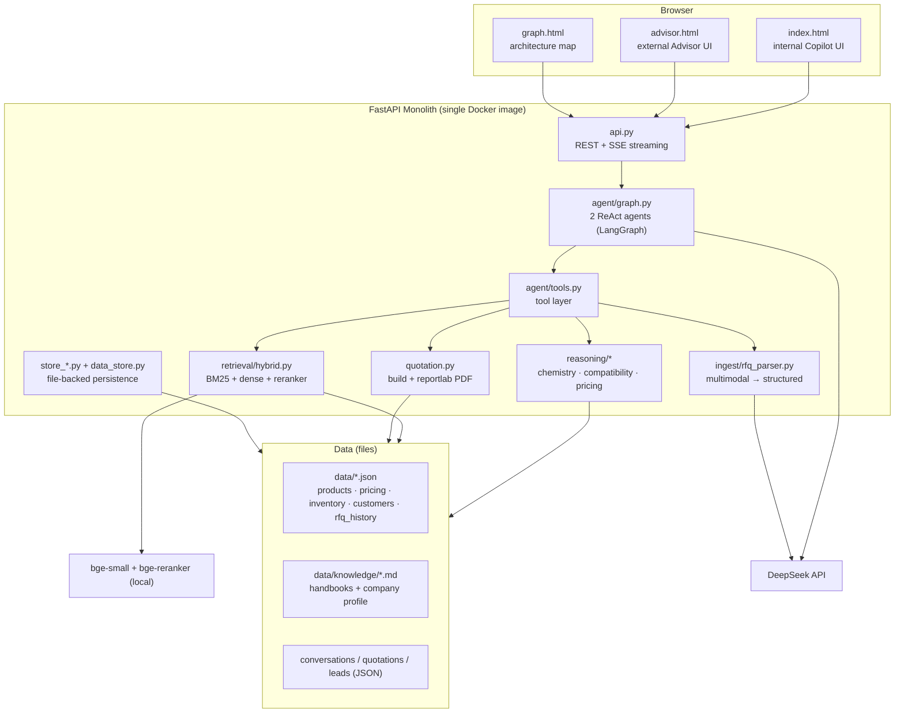
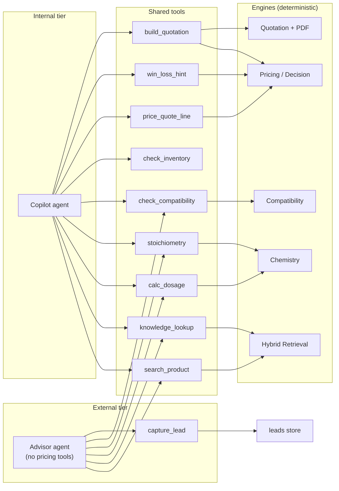
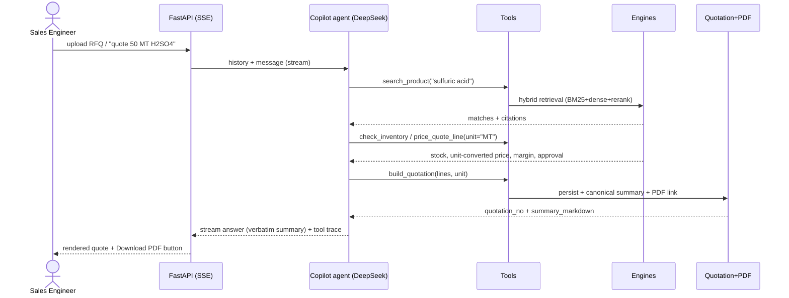
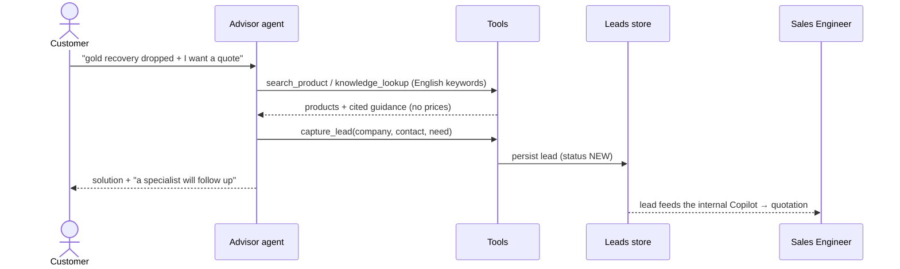
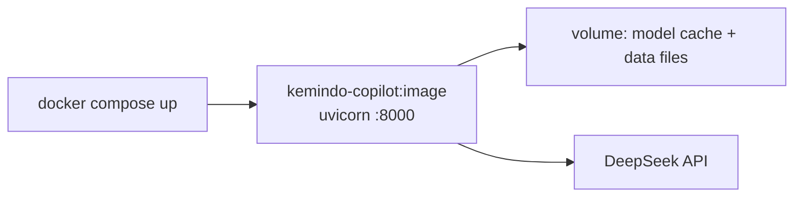

# Technical Architecture — Kemindo Industrial Intelligence Platform

This document describes the system **as built**. For the interactive version, run the
app and open [`/graph`](http://127.0.0.1:8000/graph). Business case: [proposal_v2.md](proposal_v2.md) ·
Roadmap: [FUTURE_DEVELOPMENT.md](FUTURE_DEVELOPMENT.md).

---

## 1. Overview

A two-tier AI platform on a single FastAPI service:

- **Solution Advisor** (external/public) — answers customers, gives technical guidance, captures leads. No pricing/margin/stock exposure.
- **Sales Engineer Copilot** (internal) — turns RFQs into margin-guarded, citable quotations + branded PDF.

Both are **ReAct agents** (LangGraph + DeepSeek) over a shared set of **deterministic tools/engines**. Design rule: **the LLM orchestrates and explains; engines compute. The LLM never invents a number, price, code, or dosage.**

---

## 2. C4 Level 1 — System Context



External dependencies are intentionally minimal: **DeepSeek** (cloud LLM) and **local bge models** for retrieval. No ERP/CRM yet (dummy internal data; see roadmap).

---

## 3. C4 Level 2 — Containers



**Why a monolith:** the whole workload is one process — agent loop + small engines + a ~50-doc corpus. No service boundary earns its complexity yet. Scaling path is in §9.

---

## 4. C4 Level 3 — Components & tools



The two agents differ only by **toolset + system prompt**. The Advisor is the Copilot's toolset minus pricing/stock/quotation, plus `capture_lead`.

---

## 5. Key flows (sequence)

### 5.1 RFQ → quotation (internal)



Every figure shown traces to a tool result in the live **audit panel** — nothing is LLM-fabricated.

### 5.2 Customer → lead (external funnel)



---

## 6. Data model & storage

File-backed, right-sized; schemas already match a future RDBMS.

| Store | Shape | Notes |
|---|---|---|
| `products.json` | catalog (48) | **real** names/brands/categories (scraped) |
| `pricing.json` | price list + `margin_rules` | dummy prices, real rule structure |
| `inventory.json` | stock per warehouse | dummy |
| `rfq_history.json` | won/lost quotes | feeds `win_loss_hint` |
| `knowledge/*.md` | handbooks + company profile | chunked by heading → cited |
| conversations / quotations / leads | one JSON per record | runtime, git-ignored |

**Retrieval index:** built in-process at startup — products + knowledge chunks → BM25 (always) + optional dense (bge) fused by **Reciprocal Rank Fusion**, then cross-encoder rerank. Brute-force over a tiny corpus; no vector DB needed yet.

---

## 7. Determinism & guardrails

The core trust property: **"LLM proposes, rules dispose."**

- **Numbers/codes are tool-only.** The agent may not name a product, price, dosage, or stock figure from memory — all come from `search_product` / engines. Prevents the classic "hallucinated price/code".
- **Unit conversion in the engine.** Customer says "50 MT" → engine converts to the kg-priced catalog (×1000) with a transparent flag. Stops 1000× quoting errors.
- **Canonical quote summary.** `build_quotation` returns `summary_markdown`; the agent presents it verbatim, so chat == persisted quote == PDF.
- **Decision engine** (`reasoning/pricing.py`) enforces floor margin, volume/payment tiers, and **approval routing** (Sales Manager / Commercial Director) — not the LLM.
- **Compatibility engine** flags hazardous co-storage (oxidizer+flammable, acid+base…).
- **Tiered exposure.** The Advisor toolset physically excludes pricing/cost/stock — internal economics cannot leak to customers.
- **Citations** on every retrieved fact; **audit panel** shows the full tool trace.

Validated by an **eval harness**: deterministic retrieval + engine gate (CI-blocking) plus LLM-judged answer quality. See `eval/`.

---

## 8. Tech decisions (and why)

| Decision | Rationale |
|---|---|
| **DeepSeek** (OpenAI-compatible) | Strong + cheap, tool-calling, available to the team. No vision/embeddings → handled by OCR + local bge |
| **LangGraph ReAct** | Mature tool-calling agent loop; two agents share tools by config |
| **FastAPI monolith** | One workload; SSE for live streaming. No microservice boundary earns its cost |
| **BM25 first; dense optional** | Pure-python, zero-download, passes all retrieval evals. Dense (bge) is graceful-fallback (currently a torch meta-tensor issue) |
| **Brute-force vectors** | ~50 docs → milliseconds. pgvector would be premature |
| **File-backed stores** | Right-sized; schemas map cleanly to Postgres later |
| **CPU torch** | LLM is in the cloud; local models are tiny → GPU adds image bloat + ops for ~0 gain |
| **reportlab PDF** | Pure-python, reliable in containers; no system rendering deps |
| **Conversation memory = last 12 turns** | Enough context, bounded tokens; per-customer threads recommended |

---

## 9. Deployment & scaling

**Today:** one Docker image, `docker compose up`. Stateless app + file volumes. CI runs the eval gate + unit tests on every push.



**Scale path (only when a real need appears):**

1. **Persistence** → PostgreSQL (users, conversations, quotations, leads, audit). Schemas already match.
2. **Vectors** → pgvector / a vector DB once the corpus exceeds a few thousand chunks; re-enable dense + reranker.
3. **Identity** → Keycloak/OAuth2 + RBAC (who sees margins, who approves).
4. **Async** → a queue only if long-running jobs (bulk ingest, email send) appear.
5. **Observability** → OpenTelemetry + token/cost metering when multi-tenant traffic justifies it.

Guiding principle: **add infrastructure when load demands it, never preemptively.** The moat is the AI/guardrail layer, not the topology.

---

## 10. Repo map (where each piece lives)

```
app/api.py            containers/endpoints (§3)         app/agent/graph.py    agents + prompts (§4,§7)
app/agent/tools.py    tool layer (§4)                   app/reasoning/*       engines (§7)
app/retrieval/        hybrid retrieval (§6)             app/ingest/           multimodal RFQ (§5)
app/quotation.py      quote + PDF (§5)                  app/store_*.py        persistence (§6)
app/architecture.py   /graph data                       app/web/*             UIs
data/                 dataset + knowledge (§6)          eval/                 guardrail tests (§7)
```
